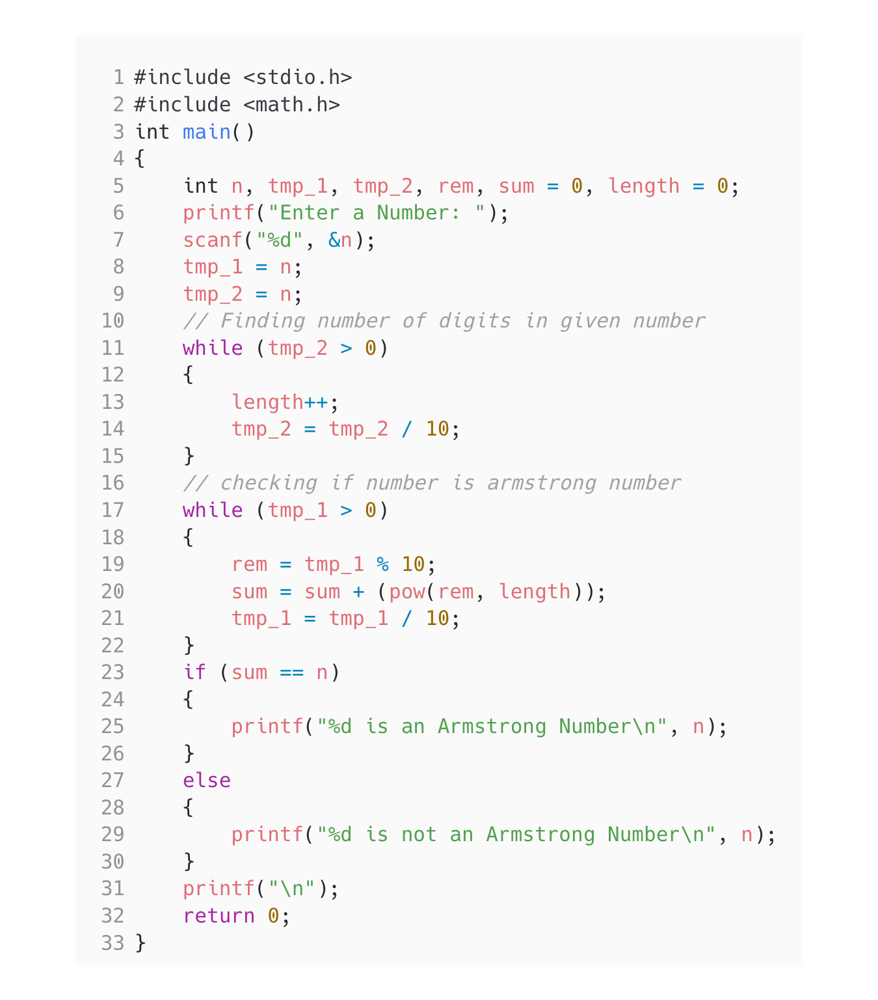

<!-- Use CTRL+K+V if you are in VS code -->

## Question [3]

WAP to check whether the entered number is Armstrong or not

## Algorithm

1. Start the program
2. Accept value of N
3. Find if number is armstrong number
4. print yes or no accordingly
5. End the program

## Code

```c
#include <stdio.h>
#include <math.h>
int main()
{
    int n, tmp_1, tmp_2, rem, sum = 0, length = 0;
    printf("Enter a Number: ");
    scanf("%d", &n);
    // temporary variables assigned to value of given number
    tmp_1 = n;
    tmp_2 = n;
    // Finding number of digits in given number
    while (tmp_2 > 0)
    {
        length++;
        tmp_2 = tmp_2 / 10;
    }
    // checking if number is armstrong number
    while (tmp_1 > 0)
    {
        rem = tmp_1 % 10;
        sum = sum + (pow(rem, length));
        tmp_1 = tmp_1 / 10;
    }
    if (sum == n)
    {
        printf("%d is an Armstrong Number\n", n);
    }
    else
    {
        printf("%d is not an Armstrong Number\n", n);
    }
    printf("\n");
    return 0;
}
```

## Output


## Code


<!-- 
Note: if you are using text-editor to view this document I highly recommend you to use vs code or sublime text so its easier to read the contents of the file
VS Code - https://code.visualstudio.com/download
Sublime Text - https://www.sublimetext.com/download 
--!>
