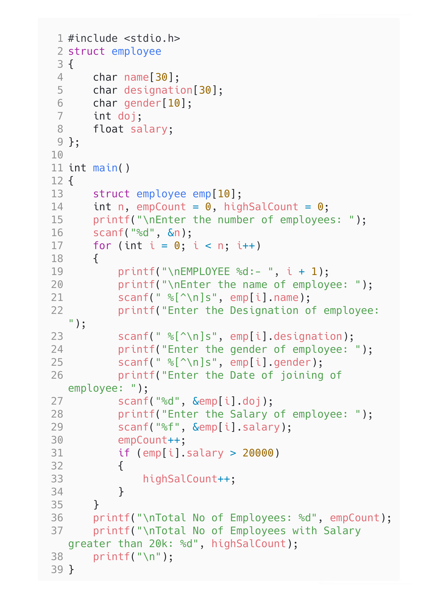

<!-- Use CTRL+K+V if you are in VS code -->

## Question [11]

WAP to accept EMPLOYEE details Name. Designation, Gender. DOJ and Salary)\
 Define function members to compute\
i)total number of employees\
ii)total number of employees with salaries greater than 20k

## Code

```c
#include <stdio.h>
struct employee
{
    char name[30];
    char designation[30];
    char gender[10];
    int doj;
    float salary;
};

int main()
{
    struct employee emp[10];
    int n, empCount = 0, highSalCount = 0;
    printf("\nEnter the number of employees: ");
    scanf("%d", &n);
    for (int i = 0; i < n; i++)
    {
        printf("\nEMPLOYEE %d:- ", i + 1);
        printf("\nEnter the name of employee: ");
        scanf(" %[^\n]s", emp[i].name);
        printf("Enter the Designation of employee: ");
        scanf(" %[^\n]s", emp[i].designation);
        printf("Enter the gender of employee: ");
        scanf(" %[^\n]s", emp[i].gender);
        printf("Enter the Date of joining of employee: ");
        scanf("%d", &emp[i].doj);
        printf("Enter the Salary of employee: ");
        scanf("%f", &emp[i].salary);
        empCount++;
        if (emp[i].salary > 20000)
        {
            highSalCount++;
        }
    }
    printf("\nTotal No of Employees: %d", empCount);
    printf("\nTotal No of Employees with Salary greater than 20k: %d", highSalCount);
    printf("\n");
}
```

## Output


## Code



<!-- 
Note: if you are using text-editor to view this document I highly recommend you to use vs code or sublime text so its easier to read the contents of the file
VS Code - https://code.visualstudio.com/download
Sublime Text - https://www.sublimetext.com/download 
--!>
