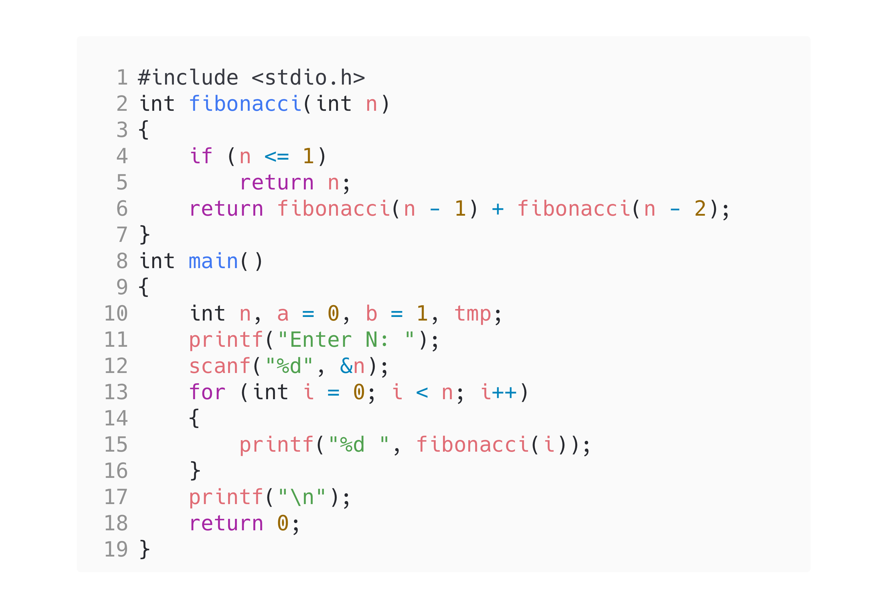

<!-- Use CTRL+K+V if you are in VS code -->

## Question [9]

WAP to display Fibonacci Series using Recursion

## Code

```c
#include <stdio.h>
int fibonacci(int n)
{
    if (n <= 1)
        return n;
    return fibonacci(n - 1) + fibonacci(n - 2);
}
int main()
{
    int n, a = 0, b = 1, tmp;
    printf("Enter N: ");
    scanf("%d", &n);
    for (int i = 0; i < n; i++)
    {
        printf("%d ", fibonacci(i));
    }
    printf("\n");
    return 0;
}
```

## Output


## Code

<!-- 
Note: if you are using text-editor to view this document I highly recommend you to use vs code or sublime text so its easier to read the contents of the file
VS Code - https://code.visualstudio.com/download
Sublime Text - https://www.sublimetext.com/download 
--!>
