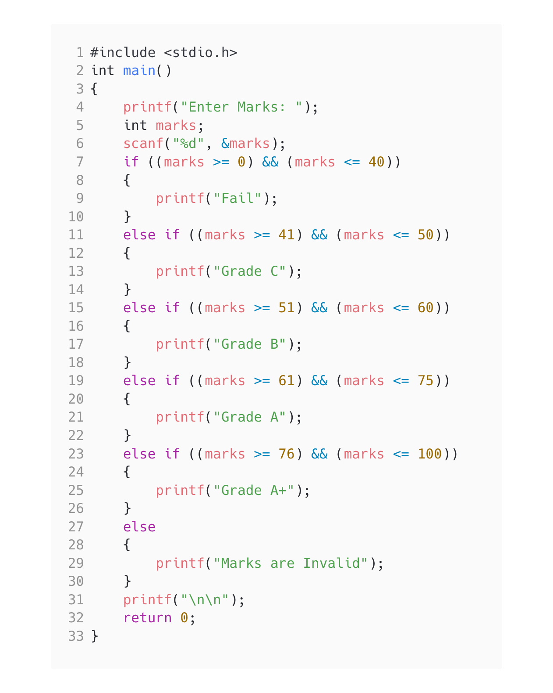

<!-- Use CTRL+K+V if you are in VS code -->

## Question [2]

WAP to display class of students according to range given (use if else ladder).

## Algorithm

1. Start the program
2. Accept marks
3. find the grades of student
4. print the grade
5. End the program

## Code

```c
#include <stdio.h>
int main()
{
    printf("Enter Marks: ");
    int marks;
    scanf("%d", &marks);
    if ((marks >= 0) && (marks <= 40))
    {
        printf("Fail");
    }
    else if ((marks >= 41) && (marks <= 50))
    {
        printf("Grade C");
    }
    else if ((marks >= 51) && (marks <= 60))
    {
        printf("Grade B");
    }
    else if ((marks >= 61) && (marks <= 75))
    {
        printf("Grade A");
    }
    else if ((marks >= 76) && (marks <= 100))
    {
        printf("Grade A+");
    }
    else
    {
        printf("Marks are Invalid");
    }
    printf("\n\n");
    return 0;
}
```

## Output


## Code

<!-- 
Note: if you are using text-editor to view this document I highly recommend you to use vs code or sublime text so its easier to read the contents of the file
VS Code - https://code.visualstudio.com/download
Sublime Text - https://www.sublimetext.com/download 
--!>
