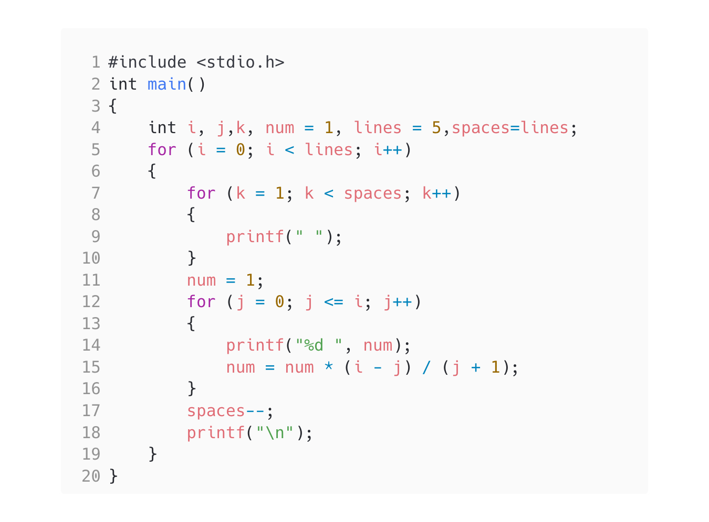

<!-- Use CTRL+K+V if you are in VS code -->

## Question [5]

WAP to display pascal triangle and patterns using for loop.

## Algorithm

1. Start the program
2. Print the pattern
3. End the program

## Code

```c
#include <stdio.h>
int main()
{
    int i, j,k, num = 1, lines = 5,spaces=lines;
    for (i = 0; i < lines; i++)
    {
        for (k = 1; k < spaces; k++)
        {
            printf(" ");
        }
        num = 1;
        for (j = 0; j <= i; j++)
        {
            printf("%d ", num);
            num = num * (i - j) / (j + 1);
        }
        spaces--;
        printf("\n");
    }
}
```

## Output


## Code



<!-- 
Note: if you are using text-editor to view this document I highly recommend you to use vs code or sublime text so its easier to read the contents of the file
VS Code - https://code.visualstudio.com/download
Sublime Text - https://www.sublimetext.com/download 
--!>
