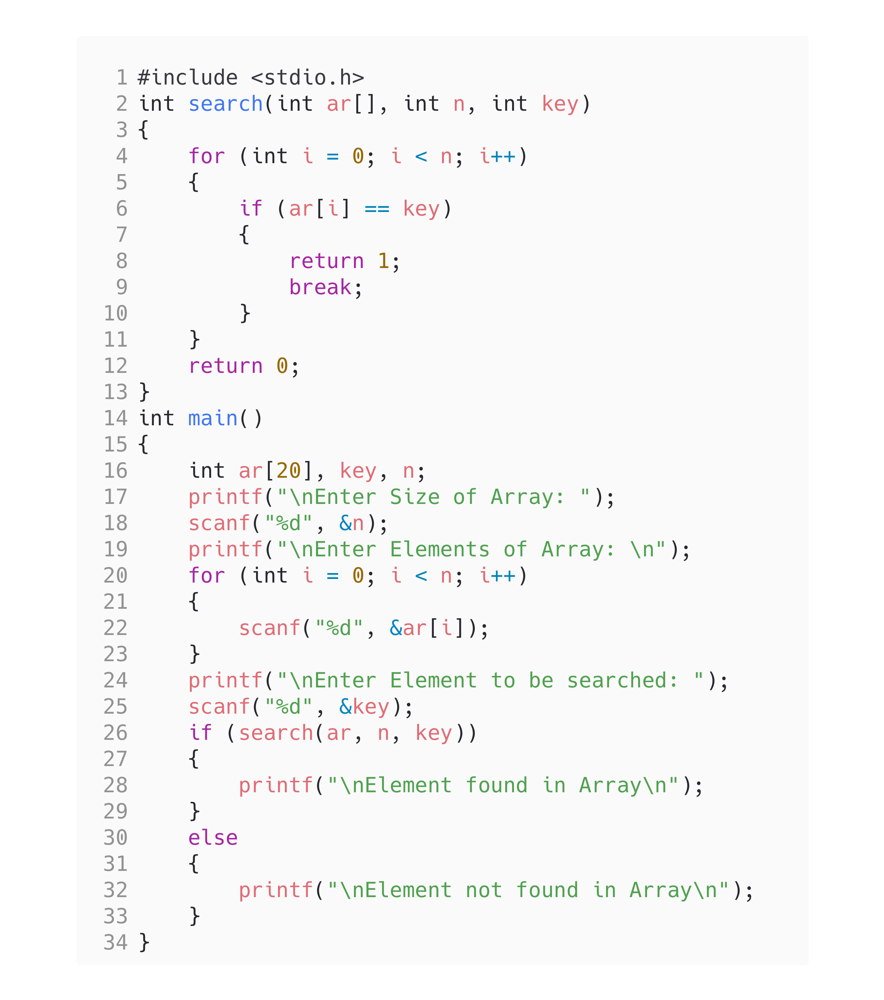

<!-- Use CTRL+K+V if you are in VS code -->

## Question [10]

WAP to search for an Element in an Array using functions

## Code

```c
#include <stdio.h>
int search(int ar[], int n, int key)
{
    for (int i = 0; i < n; i++)
    {
        if (ar[i] == key)
        {
            return 1;
            break;
        }
    }
    return 0;
}
int main()
{
    int ar[20], key, n;
    printf("\nEnter Size of Array: ");
    scanf("%d", &n);
    printf("\nEnter Elements of Array: \n");
    for (int i = 0; i < n; i++)
    {
        scanf("%d", &ar[i]);
    }
    printf("\nEnter Element to be searched: ");
    scanf("%d", &key);
    if (search(ar, n, key))
    {
        printf("\nElement found in Array\n");
    }
    else
    {
        printf("\nElement not found in Array\n");
    }
}
```

## Output


## Code



<!-- 
Note: if you are using text-editor to view this document I highly recommend you to use vs code or sublime text so its easier to read the contents of the file
VS Code - https://code.visualstudio.com/download
Sublime Text - https://www.sublimetext.com/download 
--!>
