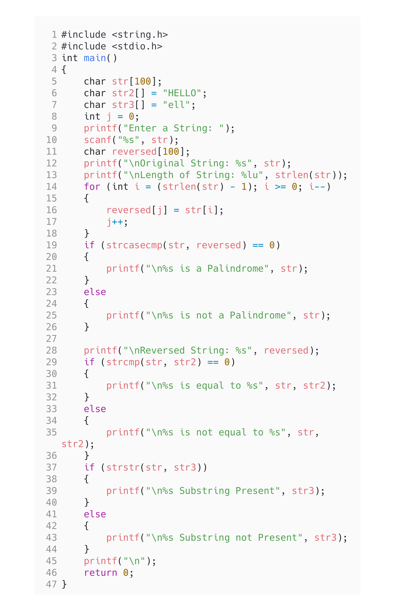

<!-- Use CTRL+K+V if you are in VS code -->

## Question [8]

WAP to accepts a string from user and perform string operations using inbuilt string function and without using string functions-\
i)
length of string\
ii) String reversal\
iii) Equality check of two strings\
iv) Check palindrome

## Code

```c
#include <string.h>
#include <stdio.h>
int main()
{
    char str[100];
    char str2[] = "HELLO";
    char str3[] = "ell";
    int j = 0;
    printf("Enter a String: ");
    scanf("%s", str);
    char reversed[100];
    printf("\nOriginal String: %s", str);
    printf("\nLength of String: %lu", strlen(str));
    for (int i = (strlen(str) - 1); i >= 0; i--)
    {
        reversed[j] = str[i];
        j++;
    }
    if (strcasecmp(str, reversed) == 0)
    {
        printf("\n%s is a Palindrome", str);
    }
    else
    {
        printf("\n%s is not a Palindrome", str);
    }

    printf("\nReversed String: %s", reversed);
    if (strcmp(str, str2) == 0)
    {
        printf("\n%s is equal to %s", str, str2);
    }
    else
    {
        printf("\n%s is not equal to %s", str, str2);
    }
    if (strstr(str, str3))
    {
        printf("\n%s Substring Present", str3);
    }
    else
    {
        printf("\n%s Substring not Present", str3);
    }
    printf("\n");
    return 0;
}
```

## Output


## Code

<!-- 
Note: if you are using text-editor to view this document I highly recommend you to use vs code or sublime text so its easier to read the contents of the file
VS Code - https://code.visualstudio.com/download
Sublime Text - https://www.sublimetext.com/download 
--!>
