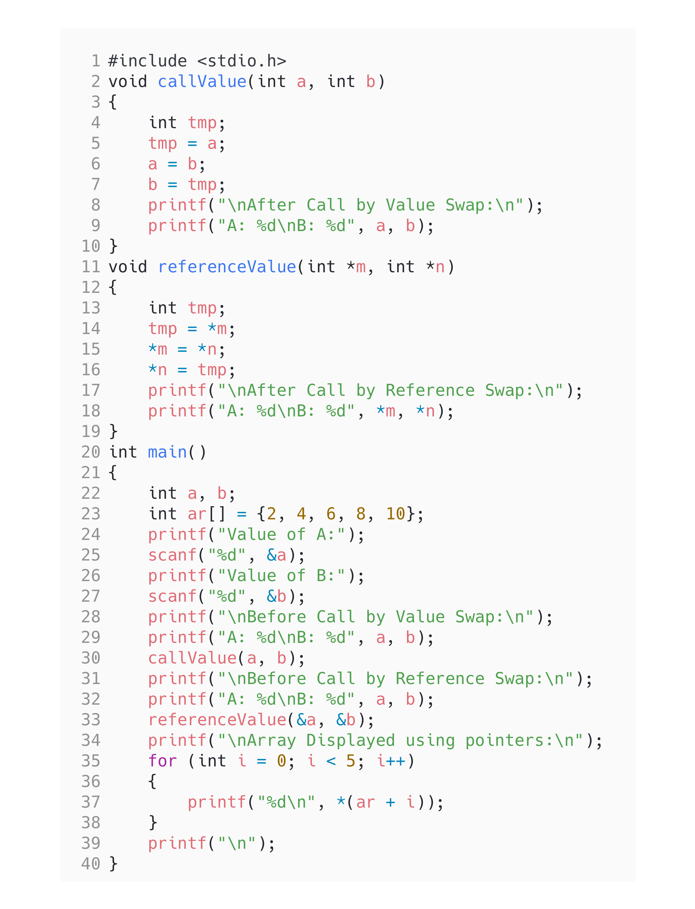

<!-- Use CTRL+K+V if you are in VS code -->

## Question [12]

a) Write a function to swap two integers using call by value.\
b) Write a function to swap two integers using call by reference.\
c) Write a program to display contents of array using pointers

## Code

```c
#include <stdio.h>
void callValue(int a, int b)
{
    int tmp;
    tmp = a;
    a = b;
    b = tmp;
    printf("\nAfter Call by Value Swap:\n");
    printf("A: %d\nB: %d", a, b);
}
void referenceValue(int *m, int *n)
{
    int tmp;
    tmp = *m;
    *m = *n;
    *n = tmp;
    printf("\nAfter Call by Reference Swap:\n");
    printf("A: %d\nB: %d", *m, *n);
}
int main()
{
    int a, b;
    int ar[] = {2, 4, 6, 8, 10};
    printf("Value of A:");
    scanf("%d", &a);
    printf("Value of B:");
    scanf("%d", &b);
    printf("\nBefore Call by Value Swap:\n");
    printf("A: %d\nB: %d", a, b);
    callValue(a, b);
    printf("\nBefore Call by Reference Swap:\n");
    printf("A: %d\nB: %d", a, b);
    referenceValue(&a, &b);
    printf("\nArray Displayed using pointers:\n");
    for (int i = 0; i < 5; i++)
    {
        printf("%d\n", *(ar + i));
    }
    printf("\n");
}
```

## Output


## Code


<!-- 
Note: if you are using text-editor to view this document I highly recommend you to use vs code or sublime text so its easier to read the contents of the file
VS Code - https://code.visualstudio.com/download
Sublime Text - https://www.sublimetext.com/download 
--!>
